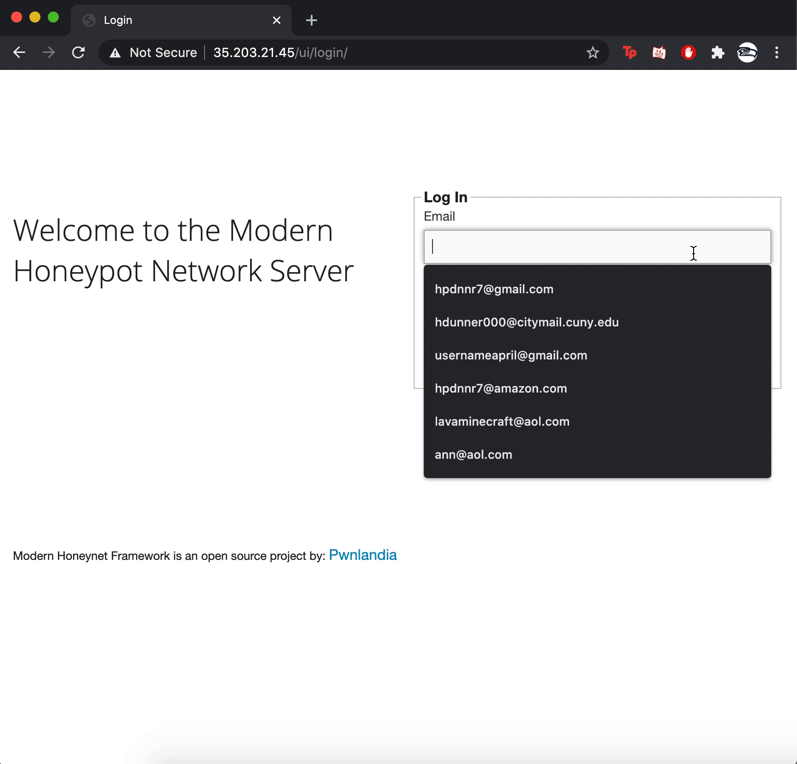
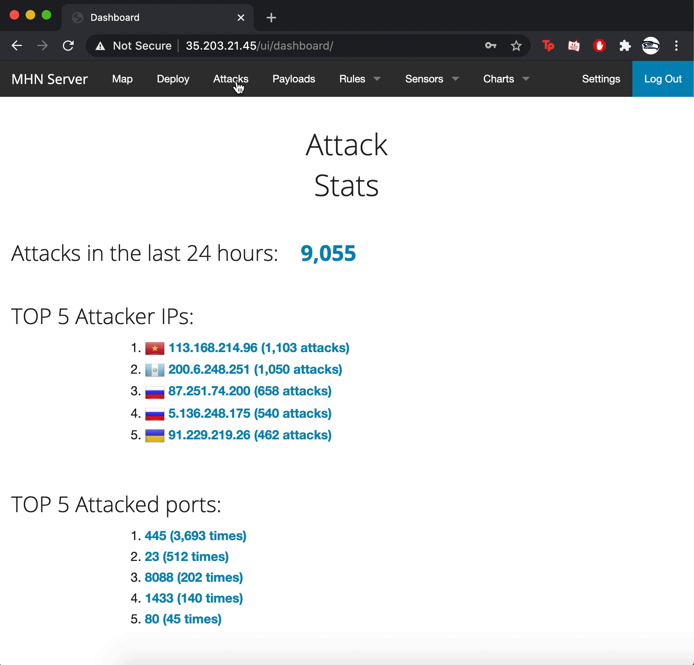
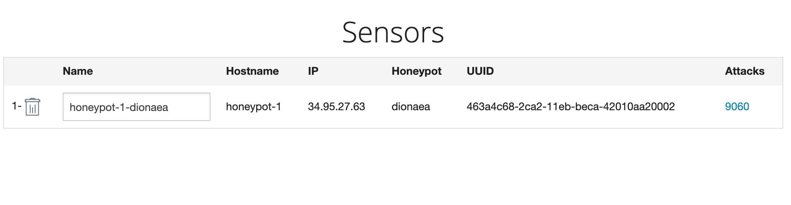
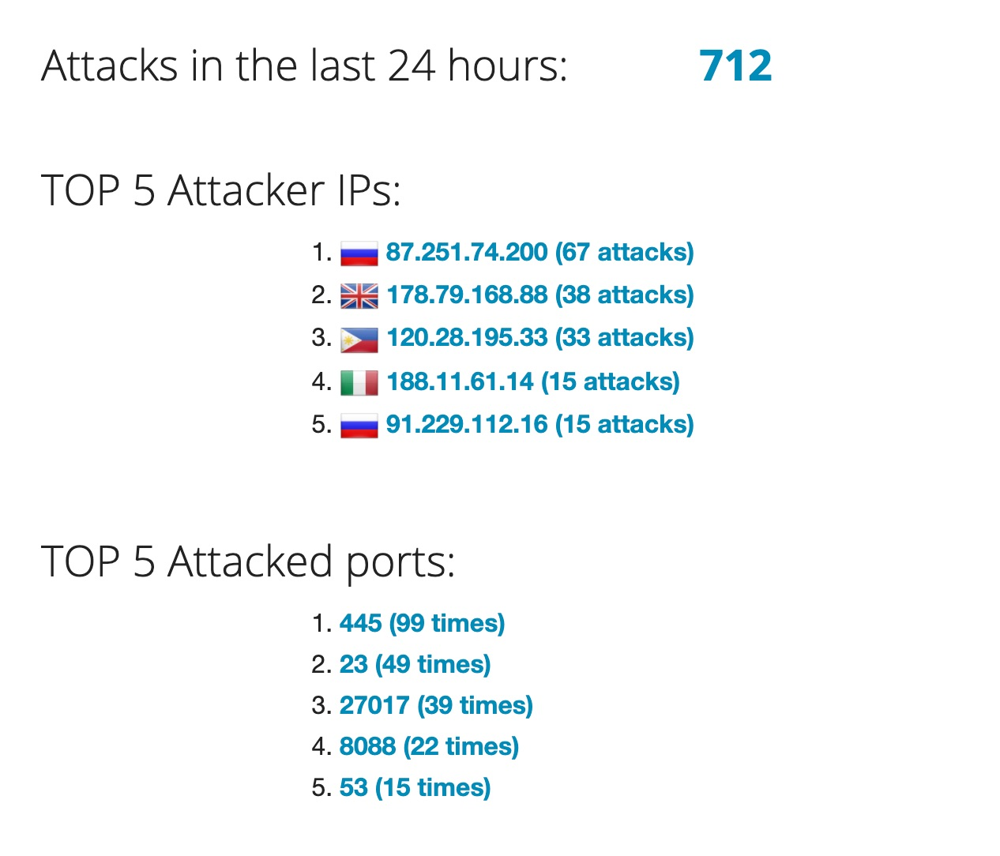

# Honeypot Assignment

**Time spent:** **24** hours spent in total

**Objective:** Create a honeynet using MHN-Admin. Present your findings as if you were requested to give a brief report of the current state of Internet security. Assume that your audience is a current employer who is questioning why the company should allocate anymore resources to the IT security team.

### MHN-Admin Deployment (Required)

**Summary:** How did you deploy it? Did you use GCP, AWS, Azure, Vagrant, VirtualBox, etc.?

I used Google Cloud Platform to deploy MHN-Admin.

### Dionaea Honeypot Deployment (Required)

**Summary:** Briefly in your own words, what does dionaea do?

Dionaea is a honeypot that lures in cyber-attackers to attack their database/ system. A Dionaea is extremely useful because it can be used to gain information about how cybercriminals operate.

### Database Backup (Required) 

**Summary:** What is the RDBMS that MHN-Admin uses? What information does the exported JSON file record?

MHN-Admin uses MongoDB. The information exported in the JSON file records every attack that was captured in my Dionaea (Honey Pot)

*Be sure to upload session.json directly to this GitHub repo/branch in order to get full credit.*

### Honeypots Deployed
I attached screenshots of the sensors as well as the top 5 attacker IP's and the top 5 attacked ports.

## Notes

Describe any challenges encountered while doing the assignment.

No specific challeneges were encountered while doing this assignment. I just didn't have MongoDB installed on my machine and had to search up how to install the platform. It was not in the codepath instructions but not difficult to accomplish.
